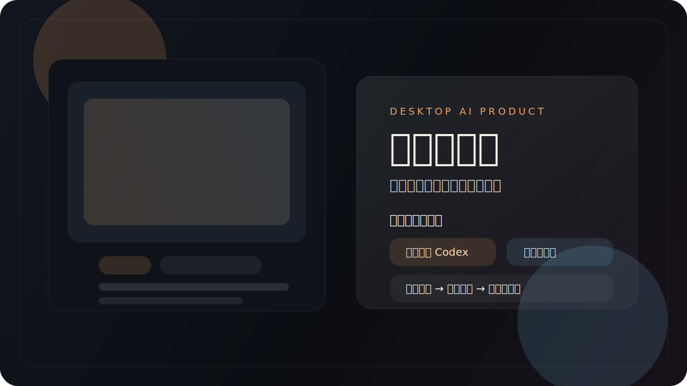

# 截图吐槽机

> 一个真能拿出来展示的桌面 AI 产品：只读联动当前 Codex 账号，把截图直接变成中文吐槽、总结和分享标题。



## What It Is

`截图吐槽机` 不是一个“上传图片然后跑个 Prompt”的玩具页。

它更像一个已经有产品形态的桌面工具：

- 有安装包
- 有桌面端交互
- 有只读账号联动
- 有本地历史记录
- 有分享卡导出

核心链路也很直接：

**截图丢进来 -> 选语气 -> 生成中文结果 -> 一键导出分享卡**

## Why It Hits

- **不是 Web Demo，是桌面安装版**
  直接打成 Windows 安装包，打开就是完整应用，不是一个半成品网页。

- **只读联动当前 Codex 账号**
  会跟随你当前的 Codex 账号状态变化，但不会改 Cockpit Tools 的源码，也不会写回它原本的逻辑。

- **输出不是“分析一下图片”，而是“给你能发的内容”**
  默认产出一句吐槽、一段总结、3 个分享标题，重点是能直接复制、直接发。

- **有产品感，不只是功能堆砌**
  拖拽导入、状态面板、历史记录、分享卡导出，这些都让它更像一个完成度很高的独立工具。

## Core Features

- 只读联动 `Codex` 当前账号
- 支持点击选图和拖拽导入
- 输出固定为简体中文
- 支持 `毒舌 / 温柔 / 打工人` 三种语气
- 支持导出分享卡 PNG
- 本地保留最近 6 条历史记录
- 可直接打包为 Windows 安装版

## How It Works

1. 打开桌面应用
2. 拖入一张截图，或者点击选择图片
3. 选择语气
4. 点击 `开始分析`
5. 复制结果，或者导出分享卡

## Install

### 本地开发

```bash
npm install
npm run dev
```

### 生产构建

```bash
npm run build
npm run preview
```

### 打包 Windows 安装版

```bash
npm run package:win
```

打包完成后会在 `release/` 下生成：

- `shot-roaster-setup-<version>.exe`：Windows 安装包
- `win-unpacked/`：免安装可执行目录

## Auth Strategy

应用会按这个顺序尝试获取可用认证：

1. 你在界面里手动填写的 `OpenAI API Key`
2. 系统环境变量里的 `OPENAI_API_KEY`
3. 当前 `Codex` 本地接入

如果本地 `Codex` 接入不可用，可以直接在界面右侧填入自己的 API Key。

## Technical Highlights

- `Electron` 桌面端壳
- `React + TypeScript` 界面层
- `Vite` 构建
- `Vitest` 测试
- 本地历史记录
- 分享卡 SVG / PNG 导出
- Cockpit / Codex 只读联动

## Project Structure

```text
electron/        Electron 主进程与本地服务接入
src/             React 界面与前端逻辑
build/           应用图标等打包资源
release/         Windows 打包产物（本地生成）
```

## Test

```bash
npm test
```

目前包含：

- 前端界面行为测试
- 账号读取测试
- 分析结果解析测试
- 分享卡生成测试

## Roadmap

- `Ctrl+V` 直接粘贴截图
- 结果二次改写
- 更多输出语气
- 历史结果搜索
- 一键复制为社交平台文案

## Build Notes

这个项目的核心约束一直是：

- 只读监听
- 不改 `Cockpit Tools` 源码
- 不破坏它原本的切号逻辑

也就是说，它追求的是 **“接得上现有工作流”**，而不是另起一套账号系统。
